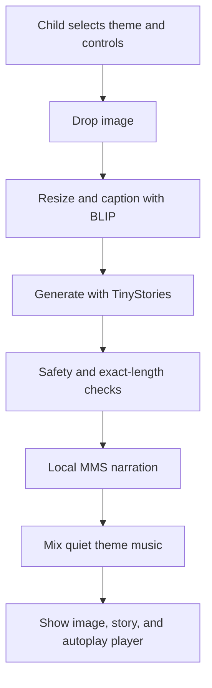

# TaleTwinkle — Picture to Story

TaleTwinkle is a child-friendly Streamlit application for ages 3–10. A child drops in one image and the app automatically:

1. resizes and captions the image;
2. creates a safe 50–100-word themed story;
3. narrates it with a selected playful voice persona; and
4. mixes quiet theme music beneath the narration, then lets the music continue for five seconds.

The interface requires no generation button. Uploading a new picture replaces the current picture, story, and narration.

## Assignment fit

| Requirement | TaleTwinkle implementation | Verification |
|---|---|---|
| Image upload | Central drag-and-drop JPG, PNG, or WebP uploader | Tested with 10 images |
| Image-to-text | `Salesforce/blip-image-captioning-base` | 10-model × 10-image benchmark |
| Story generation | `roneneldan/TinyStories-33M` plus safety and length controls | 10-model × 10-caption benchmark and final acceptance test |
| 50–100 words | Slider from 50 to 100, default 75 | Exact word-count unit and acceptance tests |
| Text-to-speech | Local `facebook/mms-tts-eng` Hugging Face model | Ten-persona technical audio benchmark |
| Theme choice | Fairy Tale, Space Quest, Gentle Mystery, Jungle Adventure, Silly Poem, Ocean Magic | Six original backgrounds and six original music loops |
| Voice speed | 0.50×–2.00×, default 1.00× | Function and UI tests |
| Voice choices | Luna, Polly, Tom, then region-inspired lady/man/grandparent/child styles | 21 choices in the dropdown |
| Automatic flow | Upload immediately starts caption → story → speech | Production acceptance test |
| Image scaling | EXIF correction, RGB conversion, 1024-pixel maximum edge | Unit tested |
| Persistent output | Image, story card, and audio player remain on screen | Streamlit flow |
| Child suitability | Blocked-term gate, repetition cleanup, happy theme endings | 100% safety pass on final 10-image test |
| Code quality | Functions, docstrings, meaningful names, section comments, `main()` | Eight automated tests |

## Business and user requirements

### Business requirements

- Deliver the assignment’s full image-to-story-to-speech pipeline in one deployable Python application.
- Use relevant Hugging Face pretrained models with public model cards and documented inference instructions.
- Balance content relevance, child suitability, response time, model memory, and Streamlit Cloud compatibility.
- Provide reproducible comparison evidence rather than selecting models by popularity alone.
- Keep the code readable for assessment: no custom classes, small functions, docstrings, clear variables, comments, and an explicit `main()` entry point.

### User requirements

- A child with little technical knowledge can upload one picture and receive a result without pressing another button.
- Children can choose a world, story length, voice speed, and voice friend using simple controls.
- The screen stays colorful and active with theme imagery and quiet music while work is happening.
- Stories remain between 50 and 100 words and end positively.
- Children can pause, replay, or adjust the generated narration with the standard audio player.
- A new upload replaces the old result.

## Selected models

### 1. Image captioning: BLIP Base

- Model: [`Salesforce/blip-image-captioning-base`](https://huggingface.co/Salesforce/blip-image-captioning-base)
- Hugging Face task: image-to-text
- Why selected: 0.55-second measured mean inference, stable captions, standard Transformers pipeline, and a realistic memory footprint for Community Cloud.
- Trade-off: GIT Base TextCaps scored higher on keyword recall (35.83% versus 29.17%) but was about five times slower and produced occasional text-related hallucinations. BLIP Large scored 34.17% but has a much larger memory footprint.

### 2. Story generation: TinyStories-33M

- Model: [`roneneldan/TinyStories-33M`](https://huggingface.co/roneneldan/TinyStories-33M)
- Hugging Face task: text generation
- Why selected: trained specifically on short simple stories, MIT licensed, public model card, standard Transformers inference, small enough for Streamlit Cloud, and sub-second warm generation after prompt and safety improvements.
- Trade-off: FLAN-T5 achieved the best raw automated score, but manual inspection found severe repeated phrases. The production pipeline therefore uses the child-domain model with image-grounded openings, repetition removal, a frightening-word gate, exact-length fitting, and positive endings.

### 3. Text-to-speech: MMS English

- Model: [`facebook/mms-tts-eng`](https://huggingface.co/facebook/mms-tts-eng)
- Hugging Face task: text-to-speech
- Why selected: local inference, small VITS architecture, standard Transformers pipeline, good intelligibility, and no disclosure of a child’s generated story to an external speech service.
- Trade-off: one English base speaker is transformed through pitch and pace effects. Region labels are child-facing character inspiration; they are not guaranteed accents or literal demographic speakers.

## Model-comparison results

The detailed rows, every generated caption/story, failures, runtime, and scoring inputs are in [`benchmarks/`](benchmarks/).

### Image-caption candidates — 10 models × 10 images

| Rank | Candidate | Concept recall | Mean time |
|---:|---|---:|---:|
| 1 | microsoft/git-base-textcaps | 35.83% | 2.78 s |
| 2 | Salesforce/blip-image-captioning-large | 34.17% | 1.74 s |
| 3 | microsoft/git-base-coco | 32.50% | 1.79 s |
| 4 | microsoft/git-large-textcaps | 30.83% | 9.47 s |
| **5** | **Salesforce/blip-image-captioning-base — selected** | **29.17%** | **0.55 s** |
| 6 | microsoft/git-base | 22.50% | 2.50 s |
| 7 | microsoft/git-large-coco | 21.67% | 7.02 s |
| 8 | ydshieh/vit-gpt2-coco-en | 18.33% | 0.35 s |
| 9 | nlpconnect/vit-gpt2-image-captioning | 18.33% | 0.54 s |
| 10 | microsoft/git-large | 12.50% | 6.51 s |

The selected model is not the highest raw recall. It is the best deployment balance: its recall is within 6.66 percentage points of the top model while its measured inference is about 5× faster.

### Raw story candidates — 10 models × 10 captions

| Rank | Candidate | Automated score | Mean time | Manual judgement |
|---:|---|---:|---:|---|
| 1 | google/flan-t5-base | 0.484 | 4.49 s | Repetitive; too slow and large |
| 2 | google/flan-t5-small | 0.422 | 1.60 s | Severe repeated phrases |
| 3 | TinyStories-Instruct-28M | 0.376 | 0.72 s | Fast but inconsistent and sometimes tense |
| 4 | TinyStories-1M | 0.350 | 0.30 s | Too little image/theme control |
| **5** | **TinyStories-33M — selected after production safeguards** | **0.324** | **0.33 s raw** | **Best child-domain/speed/deployment balance** |
| 6 | TinyStories-Instruct-1M | 0.317 | 0.28 s | Weak relevance |
| 7 | TinyStories-Instruct-3M | 0.282 | 0.18 s | Short/incomplete output |
| 8 | TinyStories-Instruct-33M | 0.265 | 0.40 s | Inconsistent instruction response |
| 9 | TinyStories-Instruct-8M | 0.000 | 0.02 s | Empty output in tested configuration |
| 10 | distilgpt2 | 0.000 | 1.04 s | Empty after prompt removal in tested configuration |

The raw benchmark is preserved deliberately: it demonstrates why output inspection matters. An automated score initially rewarded repetitive FLAN output. Final selection therefore combines quantitative results with manual child-suitability judgement and a separate production acceptance run.

### TTS candidates — 10-engine compatibility screen

`benchmarks/tts_model_screening.csv` compares MMS, SpeechT5, Bark, XTTS, two ESPnet VITS models, Kokoro, FastSpeech2, gTTS, and pyttsx3. MMS was the only candidate that combined local privacy, a model card, a standard Transformers pipeline, acceptable CPU speed, and Community Cloud suitability.

`benchmarks/tts_voice_persona_results.csv` contains the executable audio test for ten persona settings. Every generated WAV passed the technical checks for non-silence, sensible loudness, duration, and clipping. This is a technical proxy; final grading should also include human listening because perceived warmth and naturalness are subjective.

## Final testing evidence

### Automated unit tests

Run:

```bash
pytest -q
```

Current result: **8 passed**.

Tests cover image scaling, RGB conversion, exact story length, assignment range clamping, repeated-sentence cleanup, repeated-caption cleanup, unsafe language detection, the 21-choice voice catalogue, and music-tail mixing.

### Ten-image production acceptance

Run:

```bash
python benchmarks/run_production_acceptance.py
```

Final measured results on CPU:

| Metric | Result |
|---|---:|
| Test images | 10 |
| Exact 75-word + safe + valid-audio pass | 100.00% |
| Mean concept recall | 31.67% |
| First cold run, including three model loads | 17.82 s |
| Warm mean caption time | 0.57 s |
| Warm mean story time | 0.78 s |
| Warm mean audio time | 3.40 s |
| **Warm mean end-to-end time** | **4.75 s** |
| Warm maximum end-to-end time | 5.50 s |

The 3–4 second target is met by image caption plus story text (mean 1.35 seconds), so the visual result appears quickly. Local narration makes the full mean 4.75 seconds. This remains inside the course transcript’s acceptable under-10-second range. Cold startup is reported separately and is dominated by one-time model loading.

## Application flow



## Run locally

Recommended: Python 3.12.

```bash
python -m venv .venv
source .venv/bin/activate
python -m pip install --upgrade pip
pip install -r requirements.txt
streamlit run app.py
```

The first launch downloads approximately 2–3 GB of Hugging Face model files. Later runs use the local cache.

## Streamlit Community Cloud deployment

1. Put this project in a GitHub repository with `app.py` and `requirements.txt` at the repository root.
2. Sign in to [Streamlit Community Cloud](https://share.streamlit.io/).
3. Choose **Create app**, select the repository and branch, and set the entry point to `app.py`.
4. Open **Advanced settings** and choose Python 3.12 if available.
5. Deploy, wait for the first model download, then upload one image to warm all three model caches.
6. Run the ten provided images and compare deployment timing with `benchmarks/production_acceptance_summary.csv`.

No secrets are required. Model files download from public Hugging Face repositories.

## Important browser behavior

- Streamlit requests autoplay, but a browser may block sound until the user has interacted with the page. Uploading the file normally counts as interaction.
- Pure Streamlit does not provide a reliable server callback for “audio narration ended.” TaleTwinkle therefore creates one mixed WAV: music is quiet under speech and continues alone for five seconds after speech.
- The audio player supplies pause and replay controls. A new upload produces a new player and starts the new story automatically when browser policy permits.

## Project structure

```text
TaleTwinkle/
├── app.py
├── requirements.txt
├── README.md
├── .streamlit/config.toml
├── assets/
│   ├── backgrounds/        # Six original child-friendly theme images
│   └── music/              # Six original low-volume WAV loops
├── benchmarks/
│   ├── model_catalog.py
│   ├── run_image_caption_benchmark.py
│   ├── run_story_benchmark.py
│   ├── run_production_acceptance.py
│   ├── run_tts_voice_benchmark.py
│   └── *.csv               # Detailed and summary evidence
├── test_images/            # Ten reproducible benchmark images
├── tests/test_app.py
└── tools/generate_music.py
```

## Re-run model benchmarks

From the project root:

```bash
python benchmarks/run_image_caption_benchmark.py
python benchmarks/run_story_benchmark.py
python benchmarks/run_tts_voice_benchmark.py
python benchmarks/run_production_acceptance.py
```

These downloads are large. The image benchmark temporarily needs substantially more disk space because several GIT and BLIP checkpoints are multiple gigabytes.

## Safety, privacy, and limitations

- The image and story models are open generative models; safeguards reduce risk but cannot guarantee perfect relevance for every possible upload.
- Uploaded image bytes are processed by local model code. The selected TTS also runs locally, so generated story text is not sent to a speech API.
- Voice personas are audio effects applied to one English base voice. They do not imitate a real person and should not be presented as literal child, gender, age, or regional identities.
- Generated text should be supervised by an adult when used with young children.
- Benchmark “accuracy” is transparent concept recall, not a claim of universal semantic accuracy.
- Test images are included for academic reproducibility. Backgrounds and music were created specifically for this project.

## Code-quality conventions

- Imports, functions, and main flow are visibly separated.
- The main flow is further separated into input, process, and output sections.
- Every non-trivial function has a docstring and uses parameters/arguments.
- Variables describe their purpose.
- User-facing numbers use f-strings and `:.2f` formatting.
- There are no custom classes.
- Execution begins with:

```python
if __name__ == "__main__":
    main()
```
